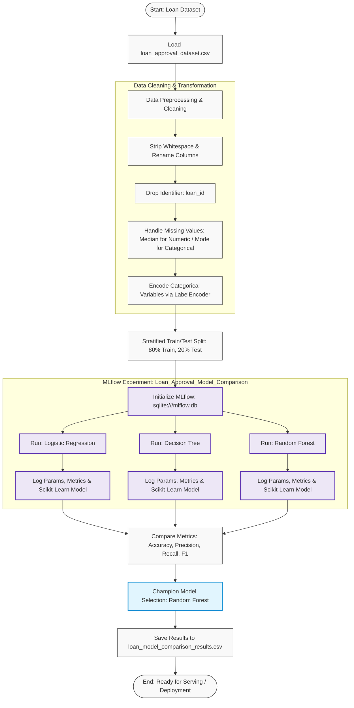

# Loan Approval Prediction - MLflow Experiment Comparison

This experiment provides an end-to-end Machine Learning Operations (MLOps) pipeline for predicting loan approvals. It benchmarks multiple classification models tracked with **MLflow**, evaluating key classification metrics and logging model artifacts, parameters, and metrics to a local SQLite tracking backend.

---

## Table of Contents
- [Overview](#overview)
- [Workflow Pipeline](#workflow-pipeline)
- [Dataset & Preprocessing](#dataset--preprocessing)
- [Models Evaluated](#models-evaluated)
- [Experiment Tracking with MLflow](#experiment-tracking-with-mlflow)
- [Performance & Results Comparison](#performance--results-comparison)
- [Project Structure](#project-structure)
- [Setup & Installation](#setup--installation)
- [How to Run](#how-to-run)
- [Viewing MLflow UI](#viewing-mlflow-ui)

---

## Overview

The objective of this experiment is to automate loan eligibility classification (`loan_status`) based on applicant financial and demographic attributes. The project tracks model iterations and performance across three candidate algorithms using **MLflow Tracking & Model Registry**:
1. **Logistic Regression** (Baseline linear classifier)
2. **Decision Tree Classifier** (Tree-based, interpretable model)
3. **Random Forest Classifier** (Ensemble bagging classifier)

---

## Workflow Pipeline



---

## Dataset & Preprocessing

The dataset (`loan_approval_dataset.csv`) contains applicant financial records and loan application attributes.

### Preprocessing Steps:
1. **Column Normalization**: Cleans leading/trailing whitespace and converts column names to snake_case format.
2. **Identifier Removal**: Removes `loan_id` to prevent synthetic indexing bias.
3. **Missing Value Imputation**:
   - **Numerical columns**: Imputed using column **median** values.
   - **Categorical columns**: Imputed using column **mode** (most frequent) values.
4. **Categorical Encoding**: All non-numeric features are transformed into integers using `LabelEncoder`.
5. **Stratified Split**: 80/20 train/test split maintaining the class distribution of `loan_status` (`stratify=y`, `random_state=42`).

---

## Models Evaluated

| Model | Hyperparameters / Configuration | Description |
|---|---|---|
| **Logistic Regression** | `max_iter=1000`, `random_state=42` | Baseline linear classification model |
| **Decision Tree Classifier** | `max_depth=5`, `random_state=42` | Interpretable non-linear tree classifier with depth constraint |
| **Random Forest Classifier** | `n_estimators=100`, `random_state=42` | Multi-tree ensemble method reducing variance and overfitting |

---

## Experiment Tracking with MLflow

MLflow is integrated to ensure full experiment reproducibility and artifact tracking:
- **Tracking URI**: `sqlite:///mlflow.db` (Local SQLite database backend)
- **Experiment Name**: `Loan_Approval_Model_Comparison`
- **Logged Parameters**:
  - `model`: Model name identifier
  - Model hyperparameters (`max_iter`, `max_depth`, `n_estimators`, `random_state`)
- **Logged Metrics**:
  - `accuracy`: Overall classification accuracy
  - `precision`: Accuracy of positive predictions (`zero_division=0`)
  - `recall`: Coverage of actual positive cases (`zero_division=0`)
  - `f1_score`: Harmonic mean of precision and recall
- **Logged Artifacts**: Serialized Scikit-Learn models logged using `mlflow.sklearn.log_model(sk_model=model, name="model")`.

---

## Performance & Results Comparison

Results evaluated on the 20% hold-out test set:

| Model | Accuracy | Precision | Recall | F1 Score |
| :--- | :---: | :---: | :---: | :---: |
| **Logistic Regression** | 82.79% | 84.65% | 66.56% | 74.52% |
| **Decision Tree** | 97.66% | 94.96% | **99.07%** | 96.97% |
| **Random Forest** (Best) | **98.36%** | **99.05%** | 96.59% | **97.81%** |

### Key Takeaways:
- **Random Forest** achieved the best overall performance with **98.36% accuracy** and an **F1 score of 97.81%**, alongside exceptional **precision (99.05%)**, drastically minimizing false-positive loan approvals.
- **Decision Tree** offered the highest recall (**99.07%**), ensuring virtually all eligible loans are captured.
- **Logistic Regression** served as a reliable baseline but underperformed compared to tree-based non-linear estimators.

---

## Project Structure

```text
D:\ML OPS\
├── 5 exp/
│   ├── Mlflow EXP Comparision.ipynb   # Main Jupyter notebook containing the full pipeline
│   └── README.md                      # Experiment documentation & overview (this file)
├── loan_approval_dataset.csv          # Source loan approval dataset
├── loan_model_comparison_results.csv  # CSV export of model performance metrics
├── mlflow.db                          # SQLite database storing MLflow tracking runs
└── mlruns/                            # MLflow artifact store directory
```

---

## Setup & Installation

### 1. Prerequisites
Ensure Python 3.9+ is installed on your system.

### 2. Install Dependencies
```bash
pip install pandas numpy scikit-learn mlflow jupyter
```

---

## How to Run

1. Open the Jupyter Notebook:
   ```bash
   jupyter notebook "D:\ML OPS\5 exp\Mlflow EXP Comparision.ipynb"
   ```
2. Execute all cells sequentially. The script will:
   - Load and clean the dataset
   - Initialize the SQLite-backed MLflow experiment
   - Train and evaluate each classifier
   - Log all metrics, parameters, and models to MLflow
   - Save comparative results to `loan_model_comparison_results.csv`

---

## Viewing MLflow UI

To interactively inspect and compare runs, parameters, metrics, and models in the MLflow UI dashboard:

1. Open your terminal in the directory containing `mlflow.db` (`D:\\ML OPS`):
   ```bash
   cd "D:\\ML OPS"
   mlflow ui --backend-store-uri sqlite:///mlflow.db
   ```
2. Open your web browser and navigate to:
   ```
   http://127.0.0.1:5000
   ```
3. In the UI:
   - Select the **`Loan_Approval_Model_Comparison`** experiment from the sidebar.
   - Compare runs side-by-side using scatter plots, parallel coordinates, and bar charts.
   - Inspect logged model artifacts and downloadable `.pkl` / `MLmodel` specifications.
