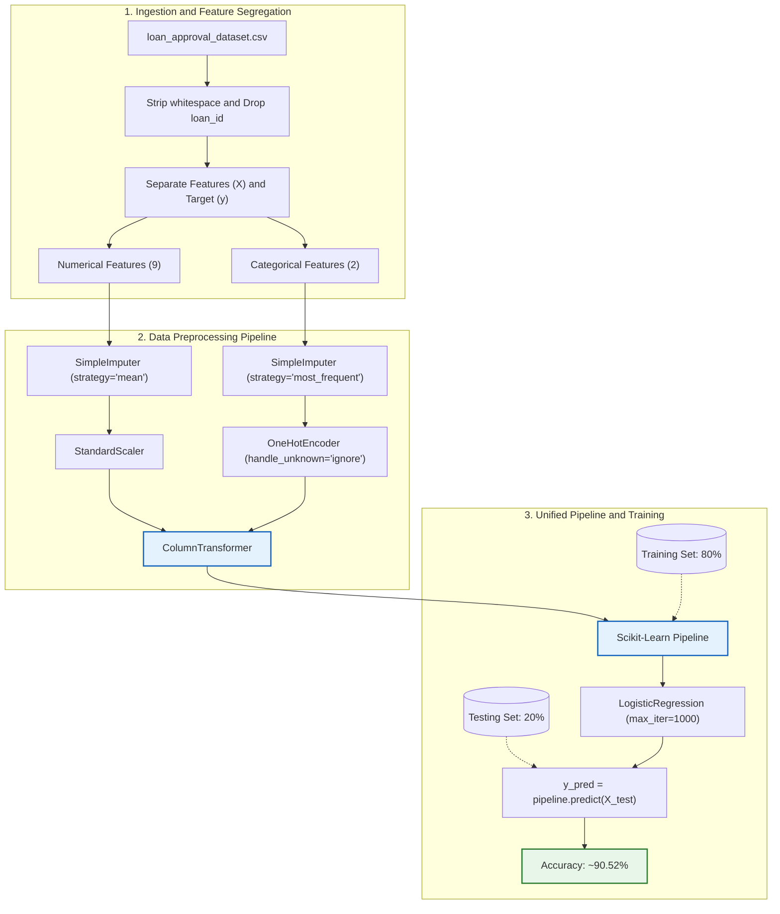

# Loan Approval Prediction Pipeline (Scikit-Learn)

An end-to-end machine learning pipeline built with **Scikit-Learn** for automated loan approval classification. This project demonstrates clean ML and MLOps practices by chaining data imputation, feature transformation, scaling, and classification into a unified, leak-free pipeline.

---

## 📌 Project Overview

Loan approval decisioning requires handling tabular datasets consisting of heterogeneous feature types (demographic indicators, financial records, credit histories, and multiple asset categories). 

This pipeline automates:
- **Data Ingestion and Cleaning**: Column whitespace normalization and identifier removal.
- **Heterogeneous Preprocessing**:
  - **Numerical features**: Handled using mean imputation followed by standardization (`StandardScaler`).
  - **Categorical features**: Handled using most-frequent imputation and one-hot encoding (`OneHotEncoder`).
- **Unified Modeling**: Integrated using Scikit-Learn's `ColumnTransformer` and `Pipeline` with a `LogisticRegression` estimator.
- **Evaluation**: Evaluated using train/test split with an accuracy score benchmark of **~90.52%**.

---

## 🏗️ Architecture & Workflow



---

## 📊 Dataset Description

The dataset `loan_approval_dataset.csv` contains **4,269 records** and **13 attributes**:

| Feature Name | Type | Description |
| :--- | :--- | :--- |
| `loan_id` | Identifier | Unique ID per applicant *(dropped from features)* |
| `no_of_dependents` | Numerical | Number of dependents supported by applicant |
| `education` | Categorical | Education level (`Graduate`, `Not Graduate`) |
| `self_employed` | Categorical | Self-employment status (`Yes`, `No`) |
| `income_annum` | Numerical | Annual income of applicant |
| `loan_amount` | Numerical | Total requested loan amount |
| `loan_term` | Numerical | Term length of loan (in years) |
| `cibil_score` | Numerical | Credit rating / CIBIL score (300 - 900) |
| `residential_assets_value` | Numerical | Market valuation of residential properties |
| `commercial_assets_value` | Numerical | Market valuation of commercial properties |
| `luxury_assets_value` | Numerical | Valuation of luxury assets (vehicles, jewelry, etc.) |
| `bank_asset_value` | Numerical | Total liquid bank balances / monetary deposits |
| **`loan_status`** | **Target** | Target classification label (`Approved` / `Rejected`) |

---

## ⚙️ Key Scikit-Learn Pipeline Design

### 1. Eliminating Data Leakage
Preprocessing transformations (such as computing mean values for imputation and feature scaling parameters) are fitted strictly on `X_train` during `pipeline.fit()`. The identical parameters are then applied to `X_test` during `pipeline.predict()`.

### 2. Numerical Transformation Branch
```python
num_pipeline = Pipeline([
    ("imputer", SimpleImputer(strategy="mean")),
    ("scaler", StandardScaler())
])
```

### 3. Categorical Transformation Branch
```python
cat_pipeline = Pipeline([
    ("imputer", SimpleImputer(strategy="most_frequent")),
    ("encoder", OneHotEncoder(handle_unknown="ignore"))
])
```

### 4. Integration with ColumnTransformer & Classifier
```python
preprocessor = ColumnTransformer([
    ("num", num_pipeline, numerical_cols),
    ("cat", cat_pipeline, categorical_cols)
])

pipeline = Pipeline([
    ("preprocessor", preprocessor),
    ("classifier", LogisticRegression(max_iter=1000))
])
```

---

## 📈 Results & Evaluation

- **Train/Test Ratio**: 80% Training / 20% Testing (`random_state=42`)
- **Classifier**: Logistic Regression with `max_iter=1000`
- **Evaluation Metric**:
  - Accuracy: **~90.52%**

*(Note: Alternative tree-based ensemble models, such as `RandomForestClassifier`, can also be plugged directly into the pipeline.)*

---

## 🚀 Getting Started

### 1. Prerequisites
Python 3.9+ is recommended. Install required packages:

```bash
pip install pandas numpy scikit-learn
```

*(Optional for notebook execution: `pip install jupyter ipykernel`)*

### 2. File Organization
```
D:\ML OPS\
├── loan_approval_dataset.csv               # Dataset
├── Scikit-learn pipeline.ipynb             # Active Pipeline Notebook
├── Reusable Machine Learning Pipeline.ipynb # Modular / Random Forest Variant
├── README.md                               # Project Documentation
└── README_House_Price_Prediction.md        # Archived Previous Project Doc
```

### 3. Running the Pipeline

#### In Jupyter Notebook / IDE:
Open `Scikit-learn pipeline.ipynb` and run all cells sequentially.

#### Exporting / Inferencing on New Data:
Because the pipeline bundles both preprocessing and model weights, you can easily serialize it using `joblib`:

```python
import joblib

# Save the trained pipeline
joblib.dump(pipeline, "loan_approval_pipeline.pkl")

# Load and predict on raw data (no manual scaling/encoding required)
loaded_pipe = joblib.load("loan_approval_pipeline.pkl")
predictions = loaded_pipe.predict(new_raw_df)
```

---

## 🔄 Next Steps & MLOps Integration

- [ ] **Model Tracking**: Track runs, metrics, and pipeline artifacts with **MLflow**.
- [ ] **Cross-Validation**: Incorporate `StratifiedKFold` cross-validation for more robust validation.
- [ ] **Hyperparameter Tuning**: Optimize hyperparameters via `GridSearchCV` or `Optuna`.
- [ ] **API Serving**: Expose the serialized pipeline as a RESTful prediction service via **FastAPI** or **Flask**.
- [ ] **Containerization**: Package into Docker for reproducible deployment across cloud environments.
