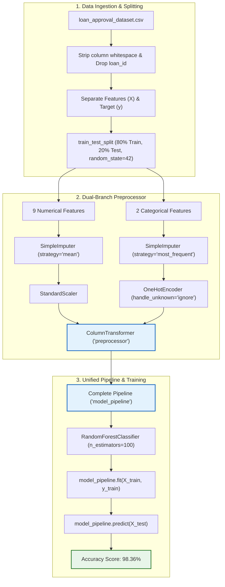

# Experiment 07: Reusable Machine Learning Pipeline

An end-to-end, modular, and leak-free machine learning pipeline using **Scikit-Learn** and **Random Forest Classifier** for automated loan approval classification. 

This experiment demonstrates how Scikit-Learn's `Pipeline` and `ColumnTransformer` create a modular architecture where feature engineering and preprocessing can be decoupled, maintained, and reused across different modeling algorithms.

---

## 📌 Experiment Overview

| Property | Details |
| :--- | :--- |
| **Notebook** | [`Reusable Machine Learning Pipeline.ipynb`](./Reusable%20Machine%20Learning%20Pipeline.ipynb) |
| **Dataset** | `loan_approval_dataset.csv` (4,269 rows, 13 features) |
| **Target Variable** | `loan_status` (`Approved` / `Rejected`) |
| **Estimator** | `RandomForestClassifier(n_estimators=100, random_state=42)` |
| **Achieved Accuracy** | **98.36%** |

---

## 🏗️ Pipeline Architecture



---

## 📊 Dataset Schema

The pipeline ingests `loan_approval_dataset.csv`, consisting of applicant financial profiles and asset valuations:

| Column Name | Category | Pipeline Role |
| :--- | :--- | :--- |
| `loan_id` | Identifier | Dropped before model fitting |
| `no_of_dependents` | Numerical | Mean Imputed $\rightarrow$ Scaled |
| `education` | Categorical | Mode Imputed $\rightarrow$ One-Hot Encoded |
| `self_employed` | Categorical | Mode Imputed $\rightarrow$ One-Hot Encoded |
| `income_annum` | Numerical | Mean Imputed $\rightarrow$ Scaled |
| `loan_amount` | Numerical | Mean Imputed $\rightarrow$ Scaled |
| `loan_term` | Numerical | Mean Imputed $\rightarrow$ Scaled |
| `cibil_score` | Numerical | Mean Imputed $\rightarrow$ Scaled |
| `residential_assets_value` | Numerical | Mean Imputed $\rightarrow$ Scaled |
| `commercial_assets_value` | Numerical | Mean Imputed $\rightarrow$ Scaled |
| `luxury_assets_value` | Numerical | Mean Imputed $\rightarrow$ Scaled |
| `bank_asset_value` | Numerical | Mean Imputed $\rightarrow$ Scaled |
| **`loan_status`** | **Categorical Target** | **Target Label (`Approved` / `Rejected`)** |

---

## 💡 Why This Pipeline Is "Reusable"

1. **Zero Data Leakage**:
   - In traditional workflows, scaling or imputing data on the full dataset before splitting leaks test data information into training statistics.
   - Here, `numerical_pipeline` and `categorical_pipeline` only compute internal parameters (such as feature means, standard deviations, and category indices) when `model_pipeline.fit()` is called on the training slice.
2. **Decoupled Preprocessing & Estimators**:
   - The `preprocessor` (`ColumnTransformer`) can be reused across any downstream scikit-learn classifier (`RandomForestClassifier`, `XGBClassifier`, `LogisticRegression`, `SVC`) without repeating preprocessing definitions.
3. **Single-Call Inference**:
   - Raw data frames with missing values and unencoded strings can be passed directly to `model_pipeline.predict(new_data)`. Preprocessing and prediction execute atomically.

---

## 💻 Implementation Highlights

### 1. Preprocessing Pipelines
```python
# Numerical pipeline
numerical_pipeline = Pipeline([
    ("imputer", SimpleImputer(strategy="mean")),
    ("scaler", StandardScaler())
])

# Categorical pipeline
categorical_pipeline = Pipeline([
    ("imputer", SimpleImputer(strategy="most_frequent")),
    ("encoder", OneHotEncoder(handle_unknown="ignore"))
])

# Unified ColumnTransformer
preprocessor = ColumnTransformer([
    ("numerical", numerical_pipeline, numerical_cols),
    ("categorical", categorical_pipeline, categorical_cols)
])
```

### 2. Complete Model Pipeline
```python
model_pipeline = Pipeline([
    ("preprocessor", preprocessor),
    ("classifier", RandomForestClassifier(
        n_estimators=100,
        random_state=42
    ))
])

# Fit on training data
model_pipeline.fit(X_train, y_train)

# Evaluate on test set
y_pred = model_pipeline.predict(X_test)
```

---

## 📈 Model Performance & Comparison

| Model | Estimator | Preprocessing | Accuracy |
| :--- | :--- | :--- | :--- |
| **Baseline** | Logistic Regression | Standardized + One-Hot Encoded | ~90.52% |
| **Experiment 07 (This Pipeline)** | **Random Forest (100 trees)** | **Standardized + One-Hot Encoded** | **98.36%** |

The ensemble random forest handles complex non-linear thresholds (such as minimum `cibil_score` vs `loan_amount` ratios) significantly better than linear models, yielding a **+7.84% accuracy improvement**.

---

## 🚀 How to Run

### 1. Requirements
Ensure Python 3.9+ is installed along with the required libraries:
```bash
pip install pandas numpy scikit-learn
```

### 2. Running the Notebook
Open [`Reusable Machine Learning Pipeline.ipynb`](./Reusable%20Machine%20Learning%20Pipeline.ipynb) in VS Code or Jupyter:
```bash
jupyter notebook "Reusable Machine Learning Pipeline.ipynb"
```

### 3. Saving & Serving the Reusable Pipeline
Serialize the entire fitted pipeline with `joblib`:
```python
import joblib

# Export pipeline
joblib.dump(model_pipeline, "loan_approval_rf_pipeline.joblib")

# Load and predict directly on new raw data
loaded_pipeline = joblib.load("loan_approval_rf_pipeline.joblib")
sample_prediction = loaded_pipeline.predict(new_applicant_df)
```

---

## 🔮 Future MLOps Enhancements

- [ ] **Feature Importances**: Extract and visualize tree-based feature importances from `model_pipeline.named_steps['classifier'].feature_importances_`.
- [ ] **MLflow Tracking**: Log hyperparameters (`n_estimators`, `max_depth`, `criterion`) and metrics to the local MLflow tracking server.
- [ ] **Threshold Tuning**: Tune prediction probability thresholds (`predict_proba`) to manage false-positive vs false-negative loan approval risk.
- [ ] **REST API Deployment**: Wrap the `joblib` artifact into a FastAPI endpoint for real-time inference.
