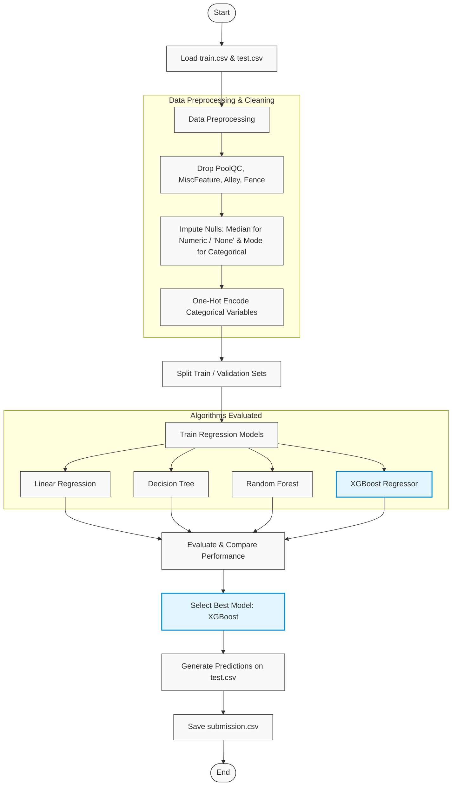

# House Price Prediction

This repository contains a machine learning pipeline for predicting house sale prices using the Ames Housing Dataset. The project cleans raw housing features, handles missing values, encodes variables, and trains multiple regression models to find the best predictor.

## Workflow Pipeline



## Data Preprocessing
The pipeline cleans data prior to model training:
*   **Feature Dropping**: Removes columns with excessive missing values (`PoolQC`, `MiscFeature`, `Alley`, `Fence`).
*   **Imputation**:
    *   *Numerical columns* (`LotFrontage`, `MasVnrArea`, `GarageYrBlt`): Imputed with their median.
    *   *Garage & Basement columns* (`GarageType`, `GarageFinish`, `GarageQual`, `GarageCond`, `BsmtQual`, `BsmtCond`, `BsmtExposure`, `BsmtFinType1`, `BsmtFinType2`): Imputed with `"None"`.
    *   *Other categorical columns* (`MasVnrType`, `FireplaceQu`): Imputed with `"None"`.
    *   *Electrical*: Imputed with the most frequent value (mode).
*   **Categorical Encoding**: All categorical features are converted to dummy/indicator variables using one-hot encoding (`pd.get_dummies`).

## Model Performance & Comparison
Four regression models were trained on 80% of the training data and validated on the remaining 20%.

| Model | MAE | MSE | RMSE | R² Score |
| :--- | :--- | :--- | :--- | :--- |
| **XGBoost** | **15,272.54** | **5.767 × 10⁸** | **24,014.71** | **0.9248** |
| **Random Forest** | 17,777.94 | 8.710 × 10⁸ | 29,512.04 | 0.8865 |
| **Decision Tree** | 27,588.30 | 1.853 × 10⁹ | 43,047.25 | 0.7584 |
| **Linear Regression** | 20,667.19 | 2.759 × 10⁹ | 52,529.84 | 0.6403 |

*Note: XGBoost is chosen as the final model due to its high R² score and lowest error metrics.*

## Usage
1.  **Dependencies**: Install the required Python packages:
    ```bash
    pip install pandas numpy scikit-learn xgboost matplotlib seaborn
    ```
2.  **Dataset Path**: Place your `train.csv` and `test.csv` in `D:\House Price Prediction\` (or update the paths in the notebook).
3.  **Run Pipeline**: Run `House_price_prediction.ipynb` cell-by-cell in a Jupyter Notebook interface.
4.  **Output**: Predictions for the test set will be saved as `submission.csv` in the working directory.
